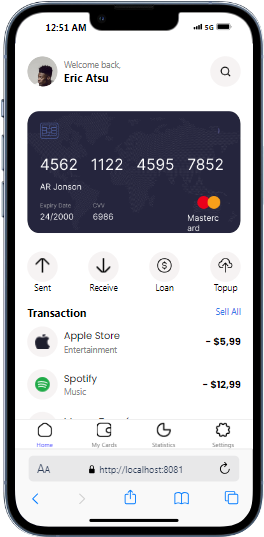
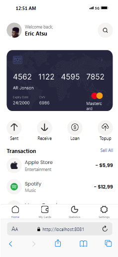
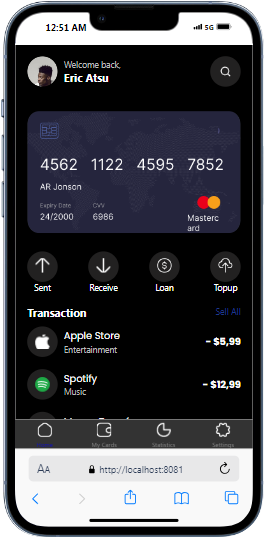
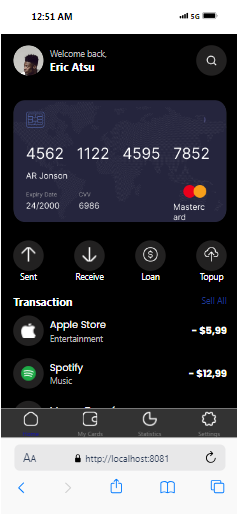
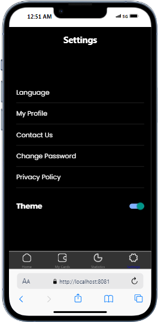
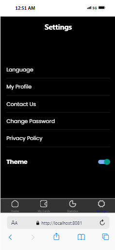

## This is a React Native Finance Project or app that allow users to switch in between dark mode and light mode.
## Below is how i made the project.
#App.js
The App.js is the main entry point of the application or project. It handles the navigation and all rougting between tbe different screens created.

## Component
# TabNavigation.js 
This component set up the tab-based navigation for the application, including the "Home" and "Settings" screens.

# SettingScreen.js 
In this component, users can toggle between light and dark mode in the app

# Tabnavigation
The TabNavigation.js component defines the structure of the tab navigation where users can render the HomeScreen and the Setting Screen 

## Screenshot of Project
[Screenshot of HomeScreen](README.md) 
 
 
 
 

